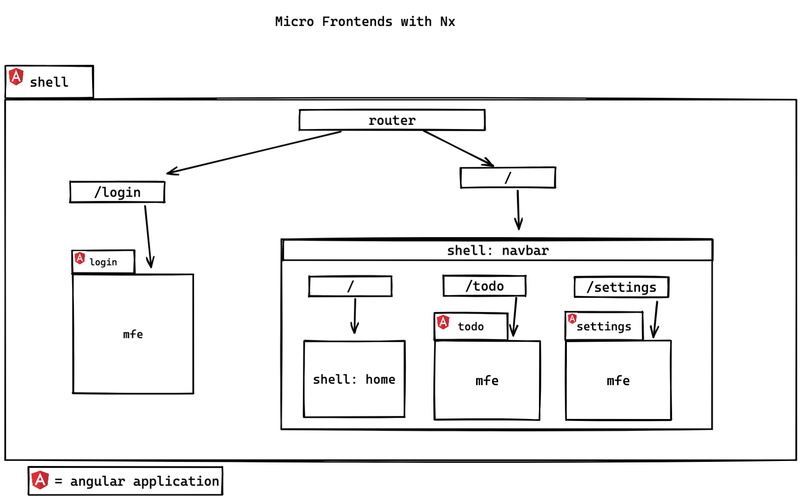

# Nx - Angular - Micro-Frontends example

install packages with pnpm

- `pnpm install`

run shell with all micro frontends

- `pnpm exec serve-mfe shell`

Above command runs shell application that loads all micro-frontends on `localhost:4200`

---

## Application routing schema:

---

Each micro-frontend runs as a separate angular application on their respective port:

- shell: ---- `localhost:4200`
- login: ---- `localhost:4201`
- todo: ----- `localhost:4202`
- settings: - `localhost:4203`
